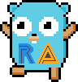

# <p align="center"><br>go-retroachievements</p>

<p align="center">
    <i>A Golang library that lets you get achievement, user, game data and more from RetroAchievements.</i>
</p>

<p align="center">
    <a href="https://api-docs.retroachievements.org/getting-started.html"><strong>Documentation: Get Started</strong></a>
</p>

<br>
<hr />

[](https://github.com/joshraphael/go-retroachievements/actions)

## Installation
Use go get to install the latest version of the library.
```sh
go get github.com/joshraphael/go-retroachievements@latest
```
Then include it in your application:
```go
import "github.com/joshraphael/go-retroachievements"
import "github.com/joshraphael/go-retroachievements/models"
```

## Usage

Construct a new Retro Achievement client using your personal web API key

```go
client := retroachievements.NewClient("<your web API key>")
```

you can now use the client to call any of the available endpoints, for example:

```go
profile, err := client.GetUserProfile(models.GetUserProfileParameters{
    Username: "jamiras",
})
```

Check out the [examples](examples/) directory for how to call each endpoint, as well as our GoDocs (TBD)

## API
For convenience, the API docs and examples can be found in the tables below

<h3>User</h3>

|Function|Description|Links|
|-|-|-|
|`GetUserProfile()`|Get a user's basic profile information.|[docs](https://api-docs.retroachievements.org/v1/get-user-profile.html) \| [example](examples/user/getuserprofile/getuserprofile.go)|
|`GetUserRecentAchievements()`|Get a list of achievements recently earned by the user.|[docs](https://api-docs.retroachievements.org/v1/get-user-recent-achievements.html) \| [example](examples/user/getuserrecentachievements/getuserrecentachievements.go)|
|`GetAchievementsEarnedBetween()`|Get a list of achievements earned by a user between two dates.|[docs](https://api-docs.retroachievements.org/v1/get-achievements-earned-between.html) \| [example](examples/user/getachievementsearnedbetween/getachievementsearnedbetween.go)|
|`GetAchievementsEarnedOnDay()`|Get a list of achievements earned by a user on a given date.|[docs](https://api-docs.retroachievements.org/v1/get-achievements-earned-on-day.html) \| [example](examples/user/getachievementsearnedonday/getachievementsearnedonday.go)|
|`GetGameInfoAndUserProgress()`|Get metadata about a game as well as a user's progress on that game.|[docs](https://api-docs.retroachievements.org/v1/get-game-info-and-user-progress.html) \| [example](examples/user/getgameinfoanduserprogress/getgameinfoanduserprogress.go)|
|`GetUserCompletionProgress()`|Get metadata about all the user's played games and any awards associated with them.|[docs](https://api-docs.retroachievements.org/v1/get-user-completion-progress.html) \| [example](examples/user/getusercompletionprogress/getusercompletionprogress.go)|
|`GetUserAwards()`|Get a list of a user's site awards/badges.|[docs](https://api-docs.retroachievements.org/v1/get-user-awards.html) \| [example](examples/user/getuserawards/getuserawards.go)|
|`GetUserClaims()`|Get a list of set development claims made over the lifetime of a user.|[docs](https://api-docs.retroachievements.org/v1/get-user-claims.html) \| [example](examples/user/getuserclaims/getuserclaims.go)|
|`GetUserGameRankAndScore()`|Get metadata about how a user has performed on a given game.|[docs](https://api-docs.retroachievements.org/v1/get-user-game-rank-and-score.html) \| [example](examples/user/getusergamerankandscore/getusergamerankandscore.go)|
|`GetUserPoints()`|Get a user's total hardcore and softcore points.|[docs](https://api-docs.retroachievements.org/v1/get-user-points.html) \| [example](examples/user/getuserpoints/getuserpoints.go)|
|`GetUserProgress()`|Get a user's progress on a list of specified games.|[docs](https://api-docs.retroachievements.org/v1/get-user-progress.html) \| [example](examples/user/getuserprogress/getuserprogress.go)|
|`GetUserRecentlyPlayedGames()`|Get a list of games a user has recently played.|[docs](https://api-docs.retroachievements.org/v1/get-user-recently-played-games.html) \| [example](examples/user/getuserrecentlyplayedgames/getuserrecentlyplayedgames.go)|
|`GetUserSummary()`|Get a user's profile metadata.|[docs](https://api-docs.retroachievements.org/v1/get-user-summary.html) \| [example](examples/user/getusersummary/getusersummary.go)|
|`GetUserCompletedGames()`|[Deprecated] Get hardcore and softcore completion metadata about games a user has played.|[docs](https://api-docs.retroachievements.org/v1/get-user-completed-games.html) \| [example](examples/user/getusercompletedgames/getusercompletedgames.go)|
|`GetUserWantToPlayList()`|Get a user's "Want to Play Games" list.|[docs](https://api-docs.retroachievements.org/v1/get-user-want-to-play-list.html) \| [example](examples/user/getuserwanttoplaylist/getuserwanttoplaylist.go)|

<h3>Game</h3>

|Function|Description|Links|
|-|-|-|
|`GetGame()`|Get basic metadata about a game.|[docs](https://api-docs.retroachievements.org/v1/get-game.html) \| [example](examples/game/getgame/getgame.go)|
|`GetGameExtended()`|Get extended metadata about a game.|[docs](https://api-docs.retroachievements.org/v1/get-game-extended.html) \| [example](examples/game/getgameextended/getgameextended.go)|
|`GetGameHashes()`|Get the hashes linked to a game.|[docs](https://api-docs.retroachievements.org/v1/get-game-hashes.html) \| [example](examples/game/getgamehashes/getgamehashes.go)|